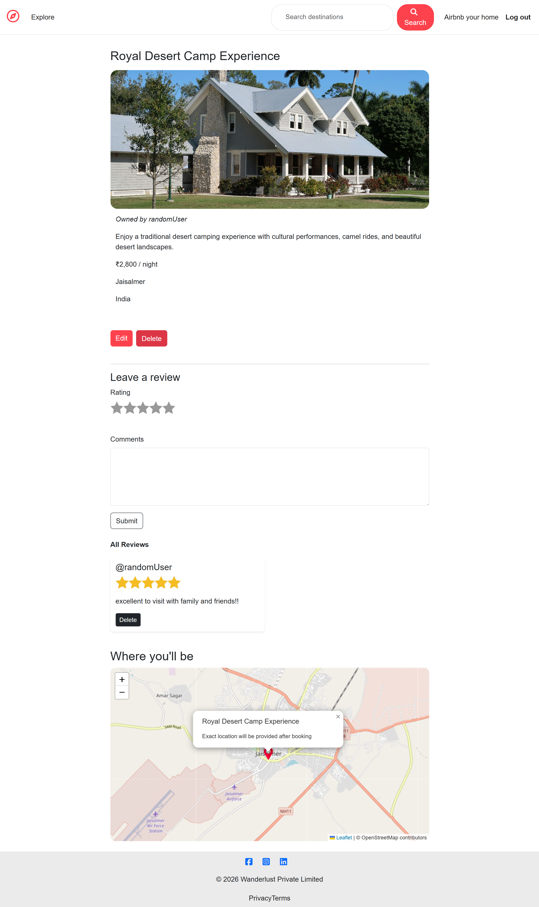
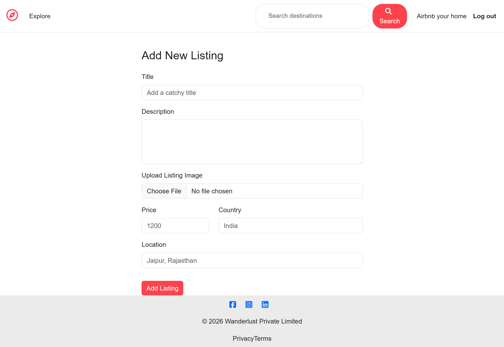
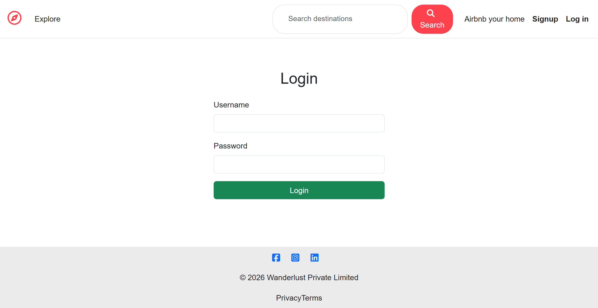
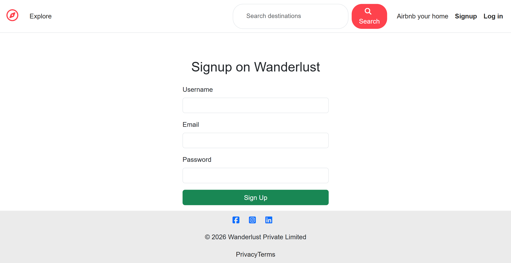

# 🌍 WanderLust – Full Stack Travel Listing Platform

WanderLust is a full-stack **Airbnb-style property listing platform** where users can explore travel destinations, create listings, upload images, and leave reviews. The application allows travelers to discover unique places while enabling hosts to share their properties.

---

## 🚀 Live Demo

🔗 https://wanderlust-0gvs.onrender.com

---

## ✨ Features

🔐 User Authentication (Signup / Login / Logout)
🏠 Create, edit, and delete property listings
🖼 Image uploads using **Cloudinary**
⭐ Review and rating system
🗺 Interactive maps with location markers
📱 Fully responsive design
☁ Cloud database using **MongoDB Atlas**
🚀 Deployed online using **Render**

---

## 🛠 Tech Stack

### Frontend

* HTML
* CSS
* Bootstrap
* EJS

### Backend

* Node.js
* Express.js

### Database

* MongoDB Atlas

### Tools & Services

* Cloudinary (image storage)
* Leaflet (map integration)
* Passport.js (authentication)
* Render (deployment)

---

## 🏗 Project Structure

```
controllers/   → Business logic  
models/        → MongoDB schemas  
routes/        → Express route handling  
views/         → EJS templates  
public/        → Static assets (CSS, JS, images)  
utils/         → Helper functions  
```

---

## 📸 Screenshots

### Homepage


### Listing Page



### Add Listing Page



### Login Page



### Signup Page



---

## 🚀 Future Improvements

• Booking functionality for listings
• Advanced search and filtering
• User profile dashboard
• Favorites / wishlist feature
• Payment integration

---

## 👨‍💻 Author

**Honey Aswani**

GitHub: https://github.com/honeyAswani
